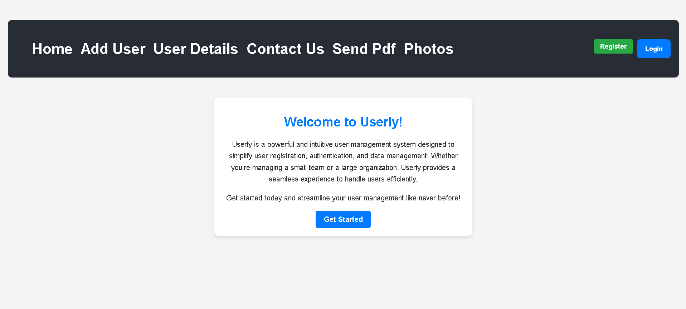
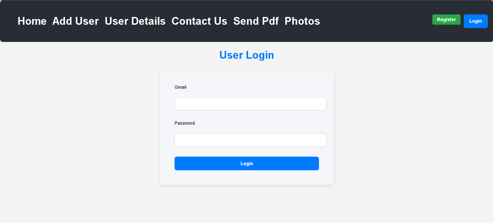

# 👤 Userly

**Userly** is a powerful and intuitive **User Management Web Application** developed using the **MERN Stack** (MongoDB, Express.js, React.js, and Node.js). It enables users to register, log in, manage their profiles, upload images, and maintain a personal image gallery.

---

## 📌 Description

Userly simplifies **user registration**, **authentication**, and **profile management**. It also provides an interactive interface to manage a personal photo collection, making it ideal for both individuals and teams looking for a lightweight user gallery and data management system.

---

## ✨ Features

- 🔐 User Registration & Login
- 🧑 View and Edit User Profiles
- 🖼️ Upload and Manage Personal Images
- 🗂️ Image Gallery Management
- 📨 Contact Form (optional)
- 📄 Send PDF (optional section)
- 🔒 Secure backend with protected routes

---

## 🛠️ Tech Stack

- **Frontend**: React.js, HTML, CSS
- **Backend**: Node.js, Express.js
- **Database**: MongoDB
- **Authentication**: JWT or similar (specify if used)
- **File Uploads**: Multer / Cloudinary (if applicable)

---

## 🖼️ Screenshots

| Home Page | Login Page |
|-----------|------------|
|  |  |

---

## 🚀 How to Run Locally

1. **Clone the repository**:
   ```bash
   git clone https://github.com/ZamranAhamed/Userly-fronend.git
   cd Userly
